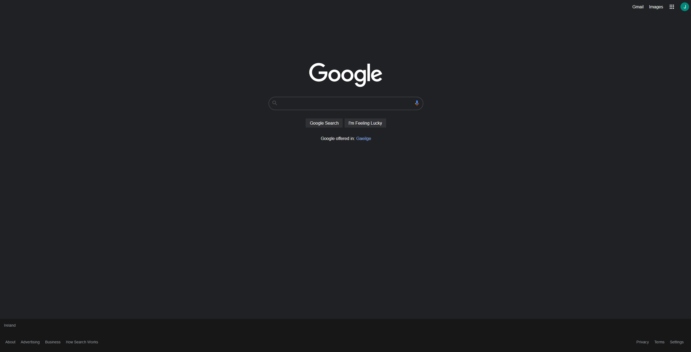

 
<h3 align="center">Google Search Webpage</h3>

Google Search webpage recreated with simple css and html

### Screenshots

  

#### Warning
This is not to be used in a commercial enviroment, it was rewritten to show how simple it is to make a clean search website 

#### Contributing
If you have any idea how to make this app better, please [create a pull request](https://github.com/JaredWestley/Google-Search-Webpage/compare). If you find any bug, please [create an issue](https://github.com/JaredWestley/Google-Search-Webpage/issues/new).

#### License
This project is licensed under an MIT license. Please check [LICENSE](LICENSE).
